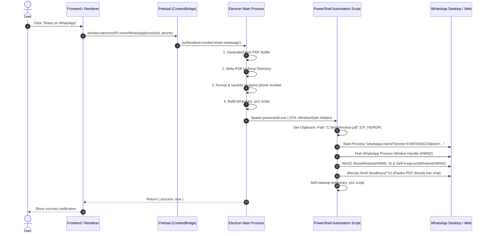

# WhatsApp PDF Sharing Implementation Guide for Electron Apps

This guide details the end-to-end architecture, Windows automation logic, IPC communication, and complete source code for implementing **one-click WhatsApp PDF sharing with automated file attachment** in an Electron application.

---

## Table of Contents
1. [The Problem & Challenges](#1-the-problem--challenges)
2. [High-Level Architecture & Workflow](#2-high-level-architecture--workflow)
3. [Step-by-Step Implementation](#3-step-by-step-implementation)
   - [Step 1: Preload Script & Context Bridge](#step-1-preload-script--context-bridge)
   - [Step 2: TypeScript Definitions](#step-2-typescript-definitions)
   - [Step 3: Main Process IPC Handler & PowerShell Automation](#step-3-main-process-ipc-handler--powershell-automation)
   - [Step 4: Frontend Utility & Multi-Platform Fallbacks](#step-4-frontend-utility--multi-platform-fallbacks)
4. [Deep Dive: Windows PowerShell Automation Script](#4-deep-dive-windows-powershell-automation-script)
5. [Critical Pitfalls & Troubleshooting](#5-critical-pitfalls--troubleshooting)
6. [How to Adapt for Your Electron App](#6-how-to-adapt-for-your-electron-app)

---

## 1. The Problem & Challenges

### Why WhatsApp PDF Sharing is Hard on Desktop
1. **WhatsApp URL limitations**: `whatsapp://send?phone=...&text=...` and `https://api.whatsapp.com/` **only accept text strings**. WhatsApp provides no URL parameter or protocol parameter to attach a binary file or local file path.
2. **Web Share API limitations**: `navigator.share({ files: [...] })` works on mobile (Android/iOS) but is not supported for files on Windows desktop browsers or Electron renderer contexts.
3. **Clipboard format requirements**: Simply copying a file path string or an image buffer is not enough; WhatsApp Desktop/Web expects the native Windows `CF_HDROP` (`FileDropList`) clipboard format to recognize it as an attached document.
4. **Interactive Station Requirements**: Automated keypresses (`Ctrl+V`) fail if the spawned process lacks an interactive desktop session or if the target window is not brought to the foreground.

---

## 2. High-Level Architecture & Workflow



---

## 3. Step-by-Step Implementation

### Step 1: Preload Script & Context Bridge
In your `electron/preload.ts`, expose the `shareWhatsApp` IPC invoke method securely to the renderer world.

```typescript
// electron/preload.ts
import { contextBridge, ipcRenderer } from 'electron';

contextBridge.exposeInMainWorld('electronAPI', {
  /**
   * Generates the invoice PDF, places it on the Windows clipboard,
   * opens WhatsApp chat with recipient, and auto-pastes the file.
   */
  shareWhatsApp: (invoiceId: number | string, customerPhone?: string) =>
    ipcRenderer.invoke('share-whatsapp', invoiceId, customerPhone),
    
  isElectron: true,
});
```

---

### Step 2: TypeScript Definitions
Make `window.electronAPI` strongly typed across your frontend components.

```typescript
// src/types/electron.d.ts
export {};

declare global {
  interface Window {
    electronAPI?: {
      shareWhatsApp: (
        invoiceId: number | string,
        customerPhone?: string
      ) => Promise<{ success: boolean; pdfPath?: string; error?: string }>;
      isElectron?: boolean;
    };
  }
}
```

---

### Step 3: Main Process IPC Handler & PowerShell Automation
Place this in your Electron main process file (`electron/main.ts` or `src/main/index.ts`).

```typescript
// electron/main.ts
import { app, ipcMain } from 'electron';
import { spawn } from 'child_process';
import * as fs from 'fs';
import * as path from 'path';
import * as os from 'os';

/**
 * Helper function to retrieve or render your PDF buffer.
 * Replace this with your own PDF generation / API fetch logic.
 */
async function renderInvoicePDFBuffer(invoiceId: number | string): Promise<Buffer> {
  // Example: fetch from your local backend or PDF generator
  // const res = await fetch(`http://127.0.0.1:3000/api/invoices/${invoiceId}/pdf`);
  // const arrayBuffer = await res.arrayBuffer();
  // return Buffer.from(arrayBuffer);
  
  // Or load existing file / pdfkit / puppeteer buffer
  throw new Error('Implement your PDF rendering logic here');
}

/**
 * Register the 'share-whatsapp' IPC handler
 */
export function registerWhatsAppShareHandler() {
  ipcMain.handle('share-whatsapp', async (_, invoiceId: number | string, customerPhone: string = '') => {
    try {
      // 1. Sanitize phone: auto-prepend country code (e.g., 91 for 10-digit Indian numbers)
      let rawDigits = customerPhone ? String(customerPhone).replace(/\D/g, '') : '';
      if (rawDigits.startsWith('0')) rawDigits = rawDigits.replace(/^0+/, '');
      const cleanPhone = rawDigits.length === 10 ? `91${rawDigits}` : (rawDigits.length >= 10 ? rawDigits : '');

      const invoiceNumber = String(invoiceId);

      // 2. Generate PDF Buffer
      const pdfBuffer = await renderInvoicePDFBuffer(invoiceId);

      // 3. Save to a temporary file
      const tmpDir = path.join(os.tmpdir(), 'myapp_whatsapp_share');
      fs.mkdirSync(tmpDir, { recursive: true });
      const pdfPath = path.join(tmpDir, `Invoice-${invoiceNumber}.pdf`);
      fs.writeFileSync(pdfPath, pdfBuffer);

      // 4. Prepare URLs (whatsapp:// custom protocol and web fallback)
      const textMessage = encodeURIComponent(
        `Dear Customer, please find your invoice ${invoiceNumber} attached. Thank you!`
      );
      
      const waProtocolUrl = cleanPhone
        ? `whatsapp://send?phone=${cleanPhone}&text=${textMessage}`
        : `whatsapp://send?text=${textMessage}`;

      const waApiUrl = cleanPhone
        ? `https://api.whatsapp.com/send/?phone=${cleanPhone}&text=${textMessage}`
        : `https://api.whatsapp.com/send/?text=${textMessage}`;

      // 5. Generate self-contained PowerShell automation script
      const psScriptPath = path.join(tmpDir, `share_wa_${Date.now()}.ps1`);
      const safePdf = pdfPath.replace(/'/g, "''");
      const safeProto = waProtocolUrl.replace(/'/g, "''");
      const safeApi = waApiUrl.replace(/'/g, "''");
      const safeScriptPath = psScriptPath.replace(/'/g, "''");

      const psScriptContent = `
$ErrorActionPreference = 'SilentlyContinue'
$logFile = Join-Path $env:TEMP 'myapp_whatsapp_share\\share_wa.log'
"$(Get-Date -Format 'yyyy-MM-dd HH:mm:ss') Starting WhatsApp share to ${cleanPhone}" | Out-File $logFile -Encoding utf8

# 1. Set native Windows clipboard with the PDF file (FileDropList format)
Set-Clipboard -Path '${safePdf}'
"Clipboard set: $((Get-Clipboard -Format FileDropList)[0].FullName)" | Out-File $logFile -Append

# 2. Declare Win32 API functions for window management
Add-Type @"
using System;
using System.Runtime.InteropServices;
public class Win32 {
    [DllImport("user32.dll", SetLastError = true)]
    public static extern bool SetForegroundWindow(IntPtr hWnd);
    [DllImport("user32.dll")]
    public static extern bool ShowWindow(IntPtr hWnd, int nCmdShow);
    [DllImport("user32.dll")]
    public static extern IntPtr GetForegroundWindow();
}
"@

# 3. Open WhatsApp chat with the customer
if ('${cleanPhone}') {
    try {
        Start-Process '${safeProto}'
        "Opened WhatsApp protocol: ${safeProto}" | Out-File $logFile -Append
    } catch {
        Start-Process '${safeApi}'
        "Opened WhatsApp API URL: ${safeApi}" | Out-File $logFile -Append
    }
} else {
    try {
        Start-Process '${safeProto}'
    } catch {
        Start-Process '${safeApi}'
    }
}

# 4. Poll for WhatsApp window and simulate Ctrl+V
$pasted = $false
for ($i = 0; $i -lt 35; $i++) {
    Start-Sleep -Milliseconds 300
    $waProc = Get-Process | Where-Object { $_.ProcessName -match 'WhatsApp' -and $_.MainWindowHandle -ne [IntPtr]::Zero } | Select-Object -First 1
    if ($waProc) {
        "Found WhatsApp: $($waProc.ProcessName) PID=$($waProc.Id) Handle=$($waProc.MainWindowHandle)" | Out-File $logFile -Append
        [Win32]::ShowWindow($waProc.MainWindowHandle, 9) | Out-Null # SW_RESTORE = 9
        [Win32]::SetForegroundWindow($waProc.MainWindowHandle) | Out-Null
        Start-Sleep -Milliseconds 900
        
        $wshell = New-Object -ComObject Wscript.Shell
        $wshell.SendKeys('^v')
        $pasted = $true
        "SendKeys ^v sent at iteration $i" | Out-File $logFile -Append
        break
    }
}

if (-not $pasted) {
    "WhatsApp process NOT found after 35 attempts" | Out-File $logFile -Append
}

Start-Sleep -Seconds 2
Remove-Item -Path '${safeScriptPath}' -ErrorAction SilentlyContinue
`;

      fs.writeFileSync(psScriptPath, psScriptContent, 'utf8');

      // 6. Execute PowerShell in background
      // CRITICAL: detached MUST be false so the process maintains access to the interactive desktop station
      const psProc = spawn('powershell.exe', [
        '-STA',                     // Single-Threaded Apartment (mandatory for clipboard)
        '-WindowStyle', 'Hidden',   // No flashing terminal window
        '-NoProfile',               // Faster startup
        '-ExecutionPolicy', 'Bypass',
        '-File', psScriptPath,
      ], {
        windowsHide: true,
        stdio: 'ignore',
        detached: false,
      });

      psProc.on('error', (err: any) => {
        console.error(`WhatsApp PowerShell spawn failed: ${err.message}`);
      });
      
      psProc.unref();

      return { success: true, pdfPath };
    } catch (err: any) {
      console.error(`WhatsApp share failed: ${err.message}`);
      return { success: false, error: err.message };
    }
  });
}
```

---

### Step 4: Frontend Utility & Multi-Platform Fallbacks
This utility can be called from buttons, tables, or modals in your React/Vue/Svelte frontend. It handles **Electron**, **Mobile Browsers (Web Share API)**, and **Desktop Browsers (Download + Copy + WhatsApp Web)** seamlessly.

```typescript
// src/utils/shareInvoice.ts

export interface ShareOptions {
  invoiceId: number | string;
  invoiceNumber: string;
  phone?: string | null;
  message?: string;
  onSuccess?: (msg: string) => void;
  onError?: (msg: string) => void;
  onLoading?: (msg: string) => void;
}

/**
 * Strips non-digits and ensures proper country code format
 */
export function sanitizeWhatsAppPhone(phone: string | null | undefined): string {
  if (!phone) return '';
  let digits = String(phone).replace(/\D/g, '');
  if (digits.startsWith('0')) digits = digits.replace(/^0+/, '');
  if (digits.length === 10) return `91${digits}`; // Adjust default country code if needed
  return digits;
}

/**
 * Universal WhatsApp share function with graceful fallbacks
 */
export async function shareInvoice(opts: ShareOptions): Promise<void> {
  const { invoiceId, invoiceNumber, phone, message = '', onSuccess, onError, onLoading } = opts;
  const cleanPhone = sanitizeWhatsAppPhone(phone);

  // ═══════════════════════════════════════════════════════════════════════════
  // 1. ELECTRON DESKTOP APP PATH (Auto-Attach with Windows Clipboard & Ctrl+V)
  // ═══════════════════════════════════════════════════════════════════════════
  if (typeof window !== 'undefined' && window.electronAPI?.shareWhatsApp) {
    onLoading?.('Preparing WhatsApp share...');
    try {
      const result = await window.electronAPI.shareWhatsApp(invoiceId, cleanPhone);
      if (result && result.success) {
        onSuccess?.('PDF attached! WhatsApp chat opened.');
        return;
      }
      throw new Error(result?.error || 'Electron WhatsApp share failed');
    } catch (e: any) {
      console.warn('Electron share failed, falling back to browser flow:', e);
    }
  }

  // ═══════════════════════════════════════════════════════════════════════════
  // 2. MOBILE WEB BROWSER PATH (Web Share API with real PDF file)
  // ═══════════════════════════════════════════════════════════════════════════
  if (typeof navigator !== 'undefined' && typeof (navigator as any).share === 'function') {
    try {
      onLoading?.('Preparing document for sharing...');
      const res = await fetch(`/api/invoices/${invoiceId}/pdf`);
      if (res.ok) {
        const blob = await res.blob();
        const file = new File([blob], `Invoice-${invoiceNumber}.pdf`, { type: 'application/pdf' });
        
        const nav = navigator as any;
        if (typeof nav.canShare === 'function' && nav.canShare({ files: [file] })) {
          await nav.share({
            title: `Invoice ${invoiceNumber}`,
            text: message,
            files: [file],
          });
          onSuccess?.('Shared successfully!');
          return;
        }
      }
    } catch (e: any) {
      if (e?.name === 'AbortError') return; // User cancelled share sheet
      console.warn('Mobile Web Share failed, falling back to desktop browser flow:', e);
    }
  }

  // ═══════════════════════════════════════════════════════════════════════════
  // 3. DESKTOP WEB BROWSER PATH (Download PDF + Open WhatsApp Web)
  // ═══════════════════════════════════════════════════════════════════════════
  try {
    onLoading?.('Downloading PDF...');
    const res = await fetch(`/api/invoices/${invoiceId}/pdf`);
    if (!res.ok) throw new Error('Failed to fetch PDF');

    const blob = await res.blob();
    const blobUrl = URL.createObjectURL(blob);

    // Auto-trigger browser download
    const a = document.createElement('a');
    a.href = blobUrl;
    a.download = `Invoice-${invoiceNumber}.pdf`;
    document.body.appendChild(a);
    a.click();
    document.body.removeChild(a);
    setTimeout(() => URL.revokeObjectURL(blobUrl), 15000);

    // Open WhatsApp Web
    const encoded = encodeURIComponent(message);
    const waUrl = cleanPhone
      ? `https://api.whatsapp.com/send/?phone=${cleanPhone}&text=${encoded}`
      : `https://api.whatsapp.com/send/?text=${encoded}`;
    
    window.open(waUrl, '_blank', 'noopener,noreferrer');
    onSuccess?.(`Invoice PDF downloaded! Attach it in WhatsApp Web.`);
  } catch (err: any) {
    onError?.(`Failed to share: ${err.message}`);
  }
}
```

---

## 4. Deep Dive: Windows PowerShell Automation Script

### Key Mechanisms Explained

| Line / Technique | Why It Is Used |
| :--- | :--- |
| `-STA` Flag | Runs PowerShell in **Single-Threaded Apartment** mode. Windows Clipboard OLE APIs require STA mode to interact with clipboard objects without throwing COM exceptions. |
| `Set-Clipboard -Path '<pdfPath>'` | Places the file into the clipboard in **`CF_HDROP` (File Drop List)** format. This makes WhatsApp recognise it as a file ready for drag-and-drop / pasting, rather than raw text. |
| `[DllImport("user32.dll")]` | Exposes `ShowWindow` and `SetForegroundWindow` from Windows `user32.dll`. |
| `ShowWindow(hWnd, 9)` | `9` represents `SW_RESTORE`. If WhatsApp was minimized to the taskbar, it un-minimizes the window. |
| `SetForegroundWindow(hWnd)` | Gives active keyboard focus to the WhatsApp window. |
| `Wscript.Shell SendKeys('^v')` | Sends `Ctrl + V` keystrokes directly into the WhatsApp input box, which triggers WhatsApp's attachment preview. |
| Self-Cleaning Script | Script cleans up its `.ps1` file upon execution to prevent temporary clutter. |

---

## 5. Critical Pitfalls & Troubleshooting

### 1. `detached: false` vs `detached: true`
- **Issue**: If you set `detached: true` in `child_process.spawn`, Windows flags the process as `DETACHED_PROCESS`.
- **Result**: A detached process does **NOT** get an interactive desktop window station. `Set-Clipboard` and `SendKeys` will silently fail without error.
- **Solution**: Keep `detached: false`, but call `psProc.unref()` so it doesn't block the Node event loop from closing.

### 2. Single Quotes in Paths & URLs
- In PowerShell, single quotes `'...'` are literal strings.
- **Rule**: Always escape single quotes in file paths or text messages by doubling them:
  ```typescript
  const safePdf = pdfPath.replace(/'/g, "''");
  const safeProto = waProtocolUrl.replace(/'/g, "''");
  ```

### 3. Timing & Sleep Durations
- WhatsApp might take 500ms to 2000ms to launch or switch chats after receiving the `whatsapp://send` protocol trigger.
- The script polls up to **35 times (every 300ms = 10.5 seconds)** until `MainWindowHandle` is valid.
- After calling `SetForegroundWindow`, a `Start-Sleep -Milliseconds 900` pause is critical before sending `^v` to ensure the chat text box is fully focused.

### 4. Logging & Diagnostics
- The PowerShell script writes timestamps and diagnostic events to `%TEMP%\myapp_whatsapp_share\share_wa.log`.
- If WhatsApp fails to paste on a customer's machine, inspect this log file to verify whether the window handle was detected and whether `SendKeys` was emitted.

---

## 6. How to Adapt for Your Electron App

1. **Copy Preload Bridge**: Add the `shareWhatsApp` function to your `preload.ts` and declare it in your `.d.ts`.
2. **Implement PDF Renderer**: In your `main.ts`, replace `renderInvoicePDFBuffer` with whatever PDF generation mechanism your app uses (e.g. `pdfkit`, Puppeteer, HTML-to-PDF, or reading a stored PDF from disk).
3. **Customize the Message**: Adjust the greeting text and variables inside `textMessage`.
4. **Call from UI**: Use the `shareInvoice()` helper from any React/Vue/Angular button in your app.
